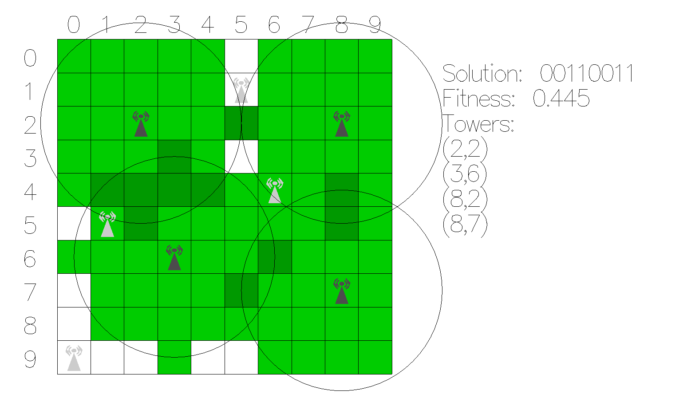
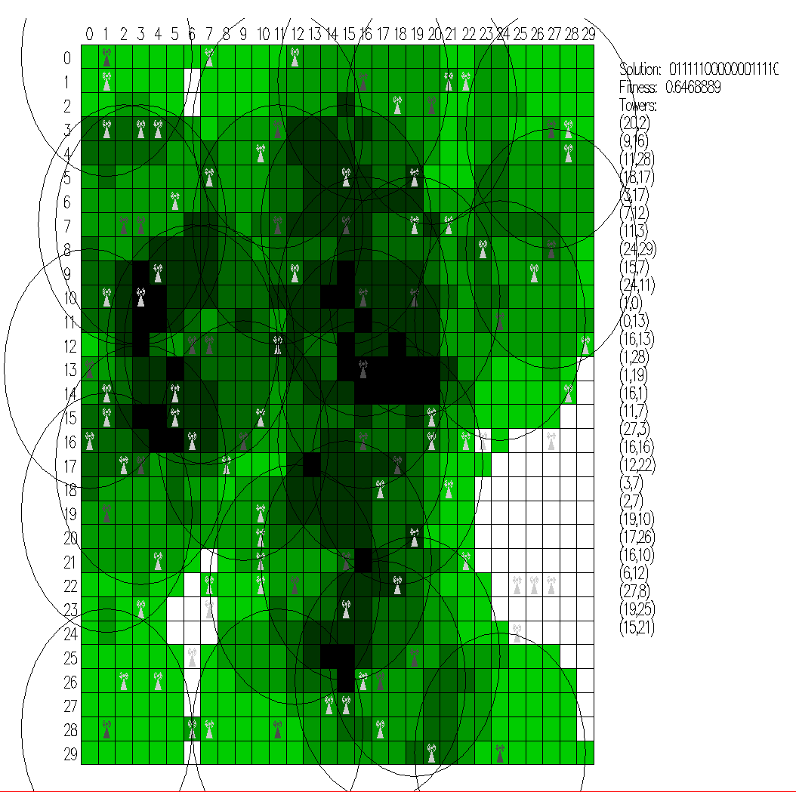
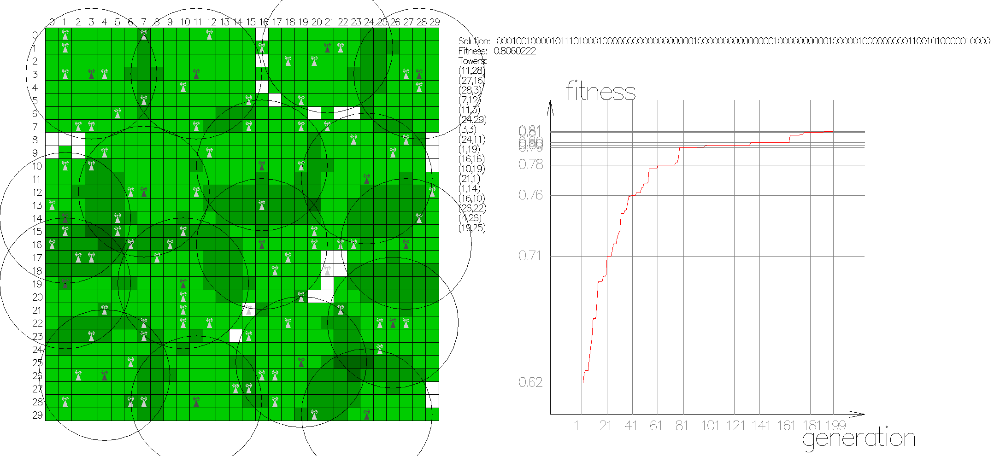

radio-problem
=============

This is simple example of genetic algorithm for solving radio problem descirbed below. The GA uses
bit string representation of possible solution, three pointed crossover operator, mutation and
best solutions copying between generations.

The description of problem:
```
There are k possible location where a radio tower could be placed. What is minimal tower count
and where they should be placed to achieve maximum coverage of network?
```

There is also fancy vizualization using [Gloss](http://gloss.ouroborus.net/):



This program is used in [BMSTU](http://www.bmstu.ru/en/) as practical task for investigating concepts
of genetic algorithms.

Example of large input data:


